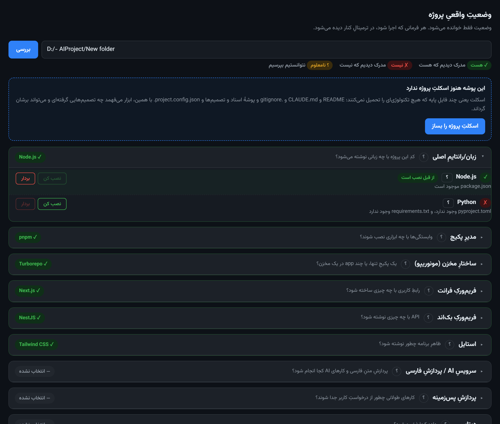

# PackageBuilder

**A local tool that turns an empty folder into a working project — one decision at a time, and never lies about what is installed.**

[فارسی](README.fa.md)



---

## What it does

You point it at a folder. It shows you a list of decisions — language, package manager, frontend, backend, database, and so on — with the real options for each. You pick one and press a button. The tool runs the technology's own official CLI in a real terminal you can watch, and adds the small amount of glue that no CLI does for you: environment variables, ports, service wiring, and a written record of the decision.

Every decision can be undone.

When the decisions are made, the tool lists what is still between you and a
running app — creating the real `.env`, filling in service keys, installing
dependencies, building the Python environment, starting the containers,
building, and running. Each step shows its exact command, and nothing runs on
its own.

## The idea behind it

Most scaffolding tools tell you what *should* be installed by reading a config file. That is not the same as what *is* installed. A package name in `package.json` does not mean the package is on disk. A service in `docker-compose.yml` does not mean the container is running.

PackageBuilder only reports what it can prove, and it has **three** answers, not two:

| | meaning |
|---|---|
| ✓ | we found proof it is there — a folder in `node_modules`, a line in `docker compose ps`, a real `.venv` |
| ✗ | we found proof it is not there |
| ? | we could not check (Docker was down, a file was unreadable) |

"Unknown" is never quietly turned into "yes" or "no". That single distinction is the reason this tool exists.

## In the browser

- Every decision group explains itself: what it settles, why it matters, and how
  the options differ.
- Every option has a panel showing its evidence, its trade-offs, **the exact
  commands an install will run**, and how removal works. That text is generated
  from the same data the engine uses, so it cannot drift from the truth.
- Persian and English, switched with one button.
- A real PowerShell sits beside the page. Every command runs there, visible.

## Rules it follows

- **No claim without proof.** Presence in a config file is not proof.
- **Nothing runs hidden.** Every command runs in a real PowerShell terminal in the page, with its full output.
- **Nothing is imposed.** A technology's files appear only after you choose it. A fresh project contains no framework, no database, no build tool.
- **Everything is reversible.** Whatever can be installed can be removed, and it stays in the list afterwards so you can install it again.
- **Your work is never overwritten.** If a file already exists, the tool leaves it alone and tells you.

## Quick start

Requires Node.js 20+, and Docker Desktop if you want database or search services.

```bash
npm install
npm start
```

Then open `http://127.0.0.1:4600`.

There is also a command line:

```bash
node src/cli.mjs new ./my-app --name "My App"   # create the skeleton
node src/cli.mjs probe ./my-app                 # real status, read-only
node src/cli.mjs stack ./my-app                 # decisions and options
node src/cli.mjs apply ./my-app --tech postgres # apply one decision
node src/cli.mjs revert ./my-app --tech postgres
```

On Windows, `start-server.bat` and `stop-server.bat` are there for convenience.

## What you can choose

20 categories, 44 technologies. Every one of them has been installed for real on an empty folder and verified with actual evidence — not assumed to work.

| Category | Options |
|---|---|
| Language / runtime | Node.js · Python |
| Package manager | pnpm · npm |
| Repository structure | Turborepo · Nx · plain pnpm workspaces |
| Frontend | React Router v7 · Next.js · Vite + React |
| UI kit | shadcn/ui + Lucide |
| Client data | TanStack Query · SWR |
| Global state | Zustand · Redux Toolkit |
| Persian dates | react-multi-date-picker |
| Shared packages | packages/ui, shared-types, api-client, config |
| Styling | Tailwind CSS · Bootstrap |
| Backend | NestJS · Express · Fastify |
| API style | REST + OpenAPI · tRPC · GraphQL |
| AI / Persian text service | Python + FastAPI · Node.js |
| Authentication | Clerk · Auth.js |
| Background jobs | BullMQ · Celery |
| Database | PostgreSQL · MySQL · MongoDB · MariaDB · SQLite |
| Search | Meilisearch · Elasticsearch |
| File storage | MinIO · S3 |
| Logging & monitoring | Sentry + pino · self-hosted Grafana/Loki/Prometheus |
| End-to-end testing | Playwright · Cypress |

Adding a new technology is a row of data, not a change to the engine.

## Security

The server can run commands, so it is treated as sensitive even though it is local:

- binds to `127.0.0.1` only
- accepts `POST` only for anything that acts
- requires a per-run random token that is injected into its own page, so another site cannot read it
- checks the request `Origin` against the `Host`

## How it is built

Node.js, no build step. `node-pty` for the real terminal, `xterm.js` to show it, `ws` for the bridge, and the plain `node:http` server. The UI is a single HTML file — edit it and refresh.

```
src/
  cli.mjs            command line
  core/
    scaffold.mjs     creates the technology-neutral skeleton
    detect.mjs       three-state detection, read-only
    registry.mjs     the 20 categories and 44 technologies — data, not code
    resolve.mjs      evaluates evidence against a real project
    apply.mjs        applying and reverting decisions
  server/
    server.mjs       http + websocket + the security layers
    terminal.mjs     a real, long-lived PowerShell
    public/index.html  the whole UI
```

## Tests

```bash
npm test      # 214 unit tests
npm run e2e   # 10 browser tests against a real server
```

The end-to-end tests do not settle for what the page says: they run `docker ps` themselves and execute `pg_isready` inside the container. A green test is meant to be evidence, not decoration.

## Status

Working and in daily use. Windows is the tested platform; the terminal layer is PowerShell-based, so Linux and macOS support is not there yet.

## License

Not licensed for redistribution yet — see the repository owner.
